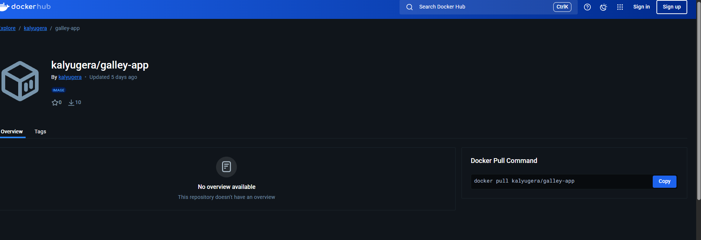
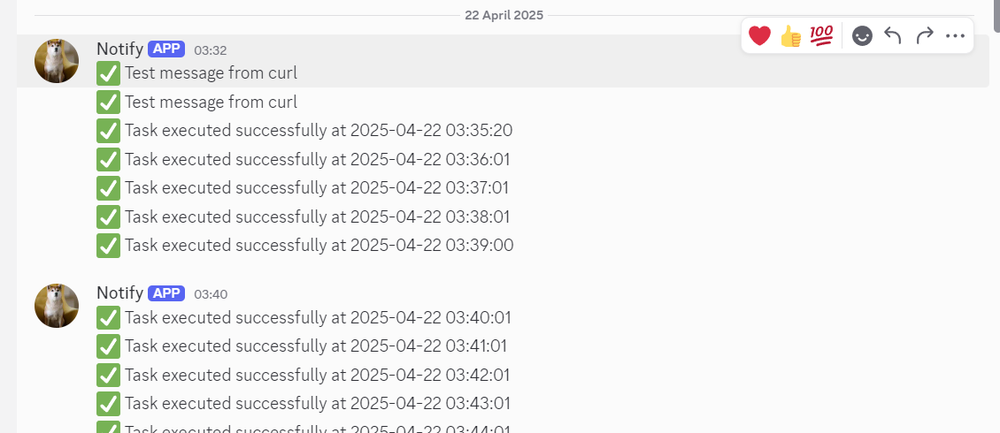

# Vulnerable Web Application

A deliberately vulnerable web application for educational purposes that allows multiple users to register, log in, manage accounts, upload images, and create posts.

## Project Description

This web application is intentionally built with security vulnerabilities for educational purposes. It includes basic user authentication, file uploads, a personal gallery for viewing uploaded images, and post creation functionality.

## Table of Contents

- [Features](#features)
- [Project Structure](#project-structure)
- [Installation](#installation)
- [Use case](#use-case)
- [Git Commands Used](#git-commands-used)
- [Docker Deployment](#docker-deployment)
- [Security Considerations](#security-considerations)

## Features

- **User Authentication**: Registration and login system
- **User Profile**: Display username and email
- **Password Management**: Ability to change passwords
- **File Upload**: Upload images to personal gallery
- **Post Creation**: Create text posts
- **Gallery View**: User-specific image gallery
- **Post View**: User-specific post view

## Project Structure
```
Vulnerable_Web/
├── uploads/              # Directory for storing uploaded images
├── .gitignore            # Git ignore file for excluding uploads and configs
├── Week1_README.md       # Project README file
├── changePassword.php    # Password change functionality
├── create_post.php       # Post creation page
├── db.php                # Database connection and initialization
├── gallery.html          # Gallery interface for viewing images
├── getImages.php         # Script to retrieve user images
├── getPost.php           # Script to retrieve user posts
├── login.php             # User login functionality
├── post.php              # Post display and management
├── register.php          # User registration functionality
├── uploadImage.php       # Image upload functionality
```
## Installation
### Prerequisites
```
- PHP 7.0 or higher
- Web server (Apache/Nginx)
- MySQL database
```

>Step 1: Clone the repository to your local machine or web server:
```
git clone https://github.com/kalyugera/Vulnerable_Web.git

cd Vulnerable_Web
```
>Step 2: Configure Database

```
Open the db.php file and update the database connection parameters to match your environment:

// Example configuration in db.php

$servername = "localhost"; // Your database server

$username = "root";        // Your database username

$password = "";            // Your database password

$dbname = "vulnerable_web"; // Your database name
```

>Step 3: Create Database

```
Create a new database named vulnerable_web (or whatever name you specified in the configuration):

mysql -u root -p

CREATE DATABASE vulnerable_web;

USE vulnerable_web;

The application will automatically create the necessary tables on first run through the db.php script.

OR You can simple copy and paste for table creation

CREATE TABLE users (
    id INT AUTO_INCREMENT PRIMARY KEY,
    username VARCHAR(50) NOT NULL,
    password VARCHAR(255) NOT NULL,
    email VARCHAR(100) NOT NULL,
    created_at TIMESTAMP DEFAULT CURRENT_TIMESTAMP
);

CREATE TABLE images (
    id INT AUTO_INCREMENT PRIMARY KEY,
    user_id INT NOT NULL,
    filename VARCHAR(255) NOT NULL,
    original_name VARCHAR(255) NOT NULL,
    upload_date TIMESTAMP DEFAULT CURRENT_TIMESTAMP,
    FOREIGN KEY (user_id) REFERENCES users(id)
);

CREATE TABLE posts (
    id INT AUTO_INCREMENT PRIMARY KEY,
    user_id INT NOT NULL,
    content TEXT NOT NULL,
    created_at TIMESTAMP DEFAULT CURRENT_TIMESTAMP,
    FOREIGN KEY (user_id) REFERENCES users(id)
);


```

>Step 4: Configure Web Server

```
Ensure your web server is configured to serve the application from the correct directory.
```

>Step 5: Create Uploads Directory

``` 
Create the uploads directory if it doesn't exist and make it writable by the web server: 
```

>Step 6: Access the Application
```
Open your web browser and navigate to the location where you've deployed the application (e.g., http://localhost/Vulnerable_Web or your configured domain).
```
## Use case
```
1.Register a new user account:
- Navigate to the registration page
- Enter username, email, and password
- Submit the form

2.Login:
- Use your credentials on the login page

3.Change Password:
- Access the change password page from the menu
- Enter your new password

4.Upload Images:
- Go to the upload page
- Select an image file
- Upload it to your gallery

5.View Gallery:
- Access your personal gallery to see uploaded images

6.Create Posts:
- Navigate to the post creation page
- Enter your content and submit
```

# Git Commands Used

### The following Git workflow was used during the development of this application:

#### Repository Initialization

```bash
git init                  # Initialize new Git repository
git add .                 # Add all files to staging
git commit -m "Initial commit with basic web application structure" 
```
#### Remote Repository Setup
```bash
git remote add origin https://github.com/kalyugera/Vulnerable_Web.git
git push -u origin main   # Push to GitHub and set upstream
```
#### Common Git Commands Used
| **Command**                | **Description**                                        |
|----------------------------|--------------------------------------------------------|
| `git status`               | Check the status of files in the repository           |
| `git add [file]`           | Stage a file for commit                               |
| `git commit -m "[message]"`| Commit staged changes with a message                  |
| `git push`                 | Push commits to the remote repository                 |
| `git pull`                 | Fetch and merge changes from the remote repository    |
| `git branch`               | List branches                                         |
| `git checkout [branch]`    | Switch to a different branch                          |
| `git merge [branch]`       | Merge a branch into the current branch                |
| `git log`                  | View commit  history                                   |
****

## Docker Deployment
[Vulnerable web app Docker link ](https://hub.docker.com/r/kalyugera/galley-app)



### Step 1: Create a Dockerfile

Create a file named **Dockerfile** in the root directory with the following content:



```bash 
FROM php:8.0-apache 
RUN docker-php-ext-install mysqli pdo pdo_mysql
COPY . /var/www/html/
EXPOSE 80 
```

### Step 2: Step 2: Create Docker Compose File

Create a file named docker-compose.yml with the following content:
```bash
version: '3.8'
services:
  web:
    build: .
    ports:
      - "8080:80"
    depends_on:
      - db
    volumes:
      - ./uploads:/var/www/html/uploads  # ✅ correct place

  db:
    image: mysql:5.7
    environment:
      MYSQL_ROOT_PASSWORD: ""
      MYSQL_ALLOW_EMPTY_PASSWORD: "yes"
      MYSQL_DATABASE: vulnerable_gallery
    ports:
      - "3306:3306"
    volumes:
      - db_data:/var/lib/mysql

volumes:
  db_data:
  ```
  ### Step 3: Build and Run with Docker Compose
  docker-compose up -d
### Step 4: Access the Application

Access the application at http://localhost:8080

###  Deploying to Docker Repositories
##### Deploying to Docker Hub (Public Repository)

```bash # Login to Docker Hub
docker login

# Build the image
docker build -t yourusername/vulnerable-web:latest .

# Push to Docker Hub
docker push yourusername/vulnerable-web:latest
```
# Security Considerations

**Important Warning:** This web application is intentionally vulnerable for educational purposes. It contains numerous security flaws that would make it unsuitable for production use.

## Known Vulnerabilities
- SQL Injection vulnerabilities in database queries
- Lack of input validation or sanitization
- Cross-Site Scripting (XSS) vulnerabilities
- Insecure file uploads without validation
- Plaintext password storage
- Absence of CSRF protection
- Weak session management practices
- Directory traversal vulnerabilities
- No secure authentication mechanisms

## Educational Use Only

This application should be used in a controlled environment for educational purposes only. Never deploy this application to a production environment or expose it to the public internet.

## Troubleshooting
### Common Issues
#### Database Connection Errors
 If you encounter database connection errors:

- Verify that your database server is running
- Check the database credentials in db.php
- Ensure the database name is correct and exists
- Check if the MySQL user has appropriate permissions

### File Upload Issues

 If file uploads are not working:

- Verify that the uploads directory exists
- Check that the uploads directory has write permissions (chmod 777)
- Check PHP configuration for upload limits (upload_max_filesize and post_max_size)
### Docker Issues
If you encounter issues with Docker deployment:

- Verify Docker and Docker Compose are properly installed
- Check Docker logs: docker-compose logs
- Ensure ports are not already in use by other services
- Try rebuilding the containers: docker-compose down && docker-compose up --build -d