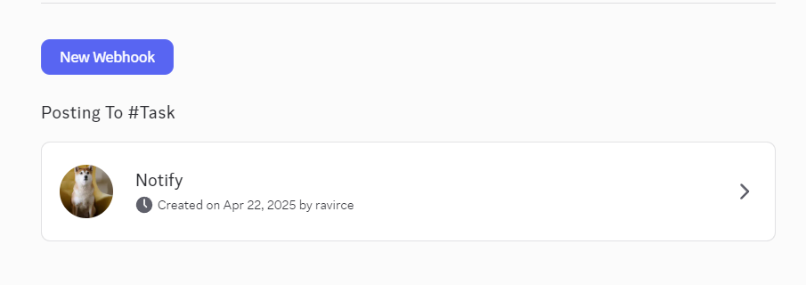
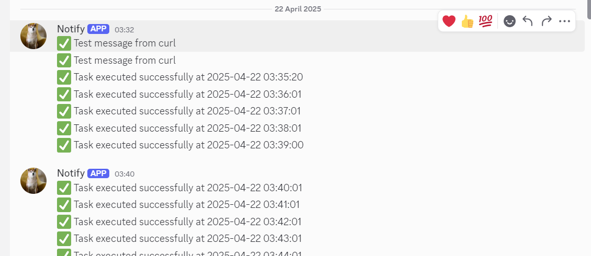

# 📄 Hourly Task Automation with Notification using Cron and Webhooks (Discord )

## ✅ Objective

To create a Bash script that:
- Runs on an **hourly basis** using `cron`
- Executes a defined **task**
- Sends a **notification message** to a specified channel (Discord)
- Includes a **timestamp** of when the task was executed

---

## 🛠 Technologies & Tools Used

- **Bash Script** – for automating task and sending notifications
- **Cron** – for task scheduling
- **Discord Webhook** – to send messages to a Discord channel
- **curl** – to make HTTP requests from the shell
- **date** – to fetch and format the current timestamp

---

## 📌 Step-by-Step Instructions

### ✅  Create a Discord Webhook

1. Go to your Discord server.
2. Right-click a text channel > **Edit Channel** > **Integrations** > **Create Webhook**
3. Name the webhook, choose a channel, and copy the **Webhook URL** (looks like `https://discord.com/api/webhooks/...`)



---
 ## 🧠 Explanation of the Script
🔹 date '+%Y-%m-%d %H:%M:%S'
- Gets the current timestamp in readable format

- Example: 2025-04-22 14:00:00

🔹 curl with Discord Webhook
```bash 
curl -H "Content-Type: application/json" \
  -X POST \
  -d '{"content": "'"$MESSAGE"'"}' \
  "$WEBHOOK_URL"
```
- Sends a JSON payload to the Discord webhook
- Uses "content" field to define the message text

## ⏰ Schedule It with cron
1. Open Crontab
`crontab -e`

2. Add this line to run the script every hour
 `0 * * * * /path/to/your/script.sh`
3. Save and exit (CTRL + X, then Y, then Enter)

## ✅ Output Example
In Discord and, you will see messages like:

`✅ Task executed successfully at 2025-04-22 14:00:00
`



